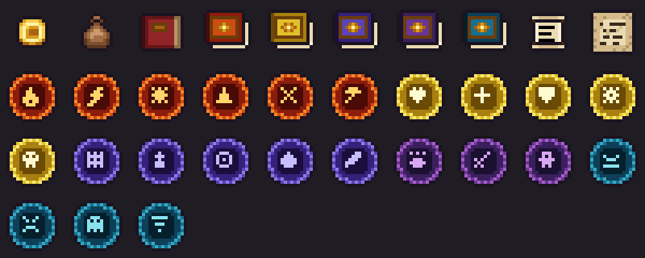
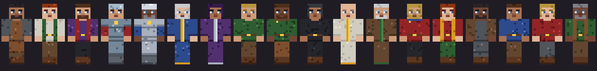

# Untamed Realms

**An RPG Minecraft server: Skyrim's freedom meets RuneScape's skills.**
Pick a class and a birthsign, level 24 skills by playing, unlock perks, take quests from
townsfolk, learn spells from tomes, haggle with merchants, pick pockets, and explore a world packed
with medieval towns, dungeons and bosses instead of grinding out a base.

| | |
|---|---|
| Minecraft | **1.21.1** |
| Loader | **NeoForge 21.1.252** |
| Java | 21 |
| Pack format | [packwiz](https://packwiz.infra.link) (exports to Modrinth `.mrpack`) |




---

## ▶ Play it on Windows (no technical setup)

You need only the normal **Minecraft Launcher** (Java Edition). Java, NeoForge and all mods download automatically.

1. **Download** [`Untamed-Realms-Windows.zip`](https://github.com/KingSaled/Untamed-Realms/releases/download/latest-test-build/Untamed-Realms-Windows.zip)
   (from the [latest test build](https://github.com/KingSaled/Untamed-Realms/releases/tag/latest-test-build)) and **extract** it
   (right-click → *Extract All…*), e.g. to your Desktop.
2. Double-click **`Start-Server.bat`** and leave that window open. The first start takes a few minutes; it is ready when it prints `Done`.
   If Windows asks to allow Java through the firewall, click *Allow*.
3. **Close the Minecraft Launcher**, then double-click **`Install-Modpack.bat`** and wait for *Done!*.
4. Open the Minecraft Launcher, pick **Untamed Realms** next to the green *PLAY* button, press *PLAY*.
5. In game: *Multiplayer → Direct Connection →* `localhost` *→ Join Server*. TurboSaled is made admin automatically (others: type `op TheirName` in the server window; the list is `admin.autoOp` in the server config).

**Start over:** stop the server (`stop`), double-click **`Reset-World.bat`**, then `Start-Server.bat` again for a brand-new world and character.

**Test world:** double-click **`Start-Test-World.bat`** instead of `Start-Server.bat` (one at a time; join `localhost` as usual). It is a
separate save (`server/test-world`) where you spawn as admin on a floating **test hub** above the starting village: every station,
item, weapon, armor set, spell tome, NPC and quest laid out in four quarters (Forge Yard, Magic, Town Square, Wilds with trees, farm,
pond, ore wall and a mob arena), plus a **control book** whose lines reset your character, set skills, learn spells, start or skip
quests and rebuild the hub. `Reset-Test-World.bat` starts it over. Your normal world is never touched.

If Windows shows *"Windows protected your PC"*, click *More info → Run anyway*. Full notes are in `README-FIRST.txt` inside the zip.
**Updating:** just run `Start-Server.bat` and `Install-Modpack.bat` again. Both download the newest build automatically and keep your world; you never need to download the zip again. The launcher keeps exactly one *Untamed Realms* installation.

---

## What's in the box

### Our mods (`mods/`, built from this repo)
| Module | What it adds |
|---|---|
| **ur-core** | Magicka & Stamina (real attributes, HUD bars that fade when full), the Crown economy (wallet + coins), Skyrim-style banners, chest-loot injection, data-driven content + client sync, shared UI kit. |
| **ur-skills** | 24 learn-by-doing skills on a RuneScape 1–99 XP curve (Combat, Magic, Stealth, Artisan), Skyrim character levels with Health/Magicka/Stamina choices, **136 perks**, passive bonuses per level, RuneScape-style skill requirements on gear/ores, XP drops, skill books, smithing quality tiers, anti place-and-break farming. |
| **ur-classes** | Character creation on first join: **11 classes** (Warrior, Knight, Barbarian, Ranger, Thief, Mage, Cleric, Spellsword, Nightblade, Bard, Artisan) with starting skills, gear and coin, plus **14 birthsigns**. |
| **ur-quests** | Quest engine (kill, collect, talk, turn-in, explore structures/biomes, mine, craft, smelt, fish, reach skill levels, cast spells), main story chapter 1, side quests, **radiant bounties** on town notice boards, journal (J) and on-screen tracker. |
| **ur-npcs** | Named townsfolk with branching dialogue and Speech checks, merchants priced by Speech, Skyrim-style trainers, pickpocketing, guards. **Villages populate themselves** with an elder, guards, a court wizard, a merchant, random tradesfolk and a notice board the first time you walk in. |
| **ur-magic** | Five schools, **23 spells** (projectiles, cones, lightning, wards, summons, bound weapons, calm/fear, invisibility...), spell tomes, a spellbook with eight quick slots, a spell wheel, Restore Magicka/Stamina potions. |
| **ur-testhub** | Developer test world (only active via `Start-Test-World.bat`): builds the test hub and adds the control book and `/ur test` commands. |
| **ur-arsenal** | Skyrim material tiers **Iron → Steel → Orcish → Dwarven → Elven → Glass → Ebony → Daedric** for daggers, swords, war axes, maces, greatswords, battleaxes, warhammers and bows (**64 weapons**, Better Combat movesets), **10 light & heavy armor sets**, four new ores, a **forge**, **tanning rack** and **workbench** (tempering) gated by Smithing, and **12 rings & amulets** worn in Curios slots. |

### Curated third-party mods (`pack/mods.yml`)
Performance (Sodium, Lithium, ModernFix, FerriteCore, ImmediatelyFast, Entity Culling, Noisium,
ServerCore...), quality of life (JEI, Jade, Xaero's maps, Waystones fast travel, Corpse,
Sophisticated Backpacks, Curios...), immersion (Better Combat, Combat Roll, Sound
Physics, Ambient Sounds...) and adventure worldgen (Terralith, Towns & Towers, YUNG's suite, When
Dungeons Arise, Dungeons & Taverns, Repurposed Structures, Explorify...) plus bosses (Mowzie's
Mobs, L_Ender's Cataclysm) and Farmer's Delight for the Cooking skill. See
[`pack/resolve-report.md`](pack/resolve-report.md) for the resolved list.

### ArtForge (`tools/artforge/`)
Every texture, NPC skin and block model we add is **generated from code**: ASCII sprite templates ×
material palettes, procedural spell icons, an NPC skin generator, and a cuboid modeller that exports
Minecraft JSON, Blockbench `.bbmodel` files and isometric previews. See its [README](tools/artforge/README.md).
Every asset follows one design language, [docs/ART_STYLE.md](docs/ART_STYLE.md) (16×16, top-left light,
palette ramps, plum outlines, centred icons, one template per family), and `python3 -m artforge lint`
enforces it in CI. Preview sheets live in [`docs/art/`](docs/art/).

---

## Quick start

**Players on Windows:** see *Play it on Windows* above. Prism Launcher / Modrinth App users can import the
`.mrpack` attached to tagged releases. Read the [player guide](docs/PLAYER_GUIDE.md).

**Server owners (Windows):** `Start-Server.bat` from the zip above. **(Linux / Docker):**
```bash
./gradlew build                                   # build the Untamed Realms mods
bash server/scripts/install.sh --dir /srv/untamed --mods-from mods
cd /srv/untamed && ./start.sh
```
or use [`server/docker-compose.yml`](server/docker-compose.yml). Full details: [docs/SERVER.md](docs/SERVER.md).

**Developers:** `./gradlew :devenv:runClient` launches a dev client with every module;
`./gradlew :devenv:runGameTestServer` runs the game tests. See [docs/ARCHITECTURE.md](docs/ARCHITECTURE.md)
and the [content authoring guide](docs/CONTENT.md) — almost all content (quests, NPCs, dialogue,
shops, spells, perks, classes, XP tables) is JSON and can be changed with a datapack.

## Repository layout
```
mods/            ur-core, ur-skills, ur-classes, ur-quests, ur-npcs, ur-magic, ur-arsenal, ur-testhub (+ devenv runner)
                 ur-arcana (alchemy & enchanting, work in progress, not built yet)
pack/            packwiz modpack: mods.yml (source of truth), lock files, config overrides
server/          install / start / smoke-test scripts, JVM flags, server.properties, docker-compose
tools/artforge/  code-driven pixel art + 3D model pipeline
tools/datagen/   generators for our default JSON content
tools/pack/      modpack resolver used by CI
docs/            architecture, roadmap, guides, art previews
```

## CI
* **Build mods** — compiles every module, runs headless **game tests** on a real server, checks ArtForge output is current.
* **Modpack** — resolves `pack/mods.yml` against Modrinth, commits the lock files, exports the `.mrpack`,
  then **boots a dedicated server with the entire pack + our mods** as a smoke test.

## Status
Early development. v0.1 is playable; **v0.2 is in testing**: arsenal tiers, ores, crafting stations,
tempering and jewelry are in, while alchemy and enchanting (ur-arcana) come after this test round.
See the [roadmap](docs/ROADMAP.md).
